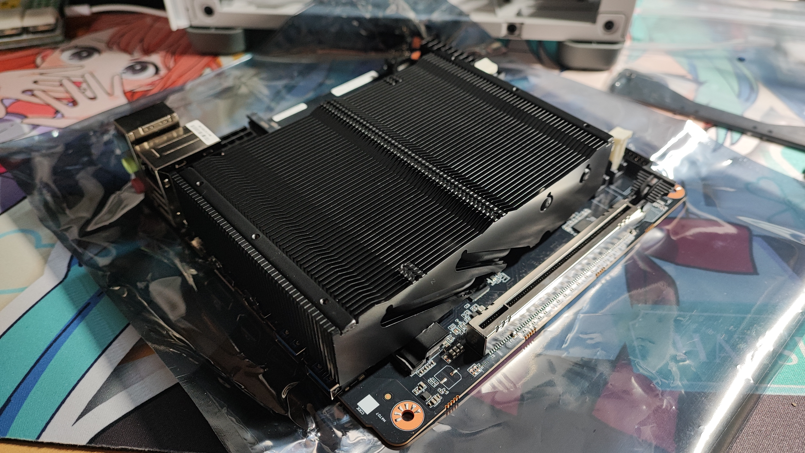
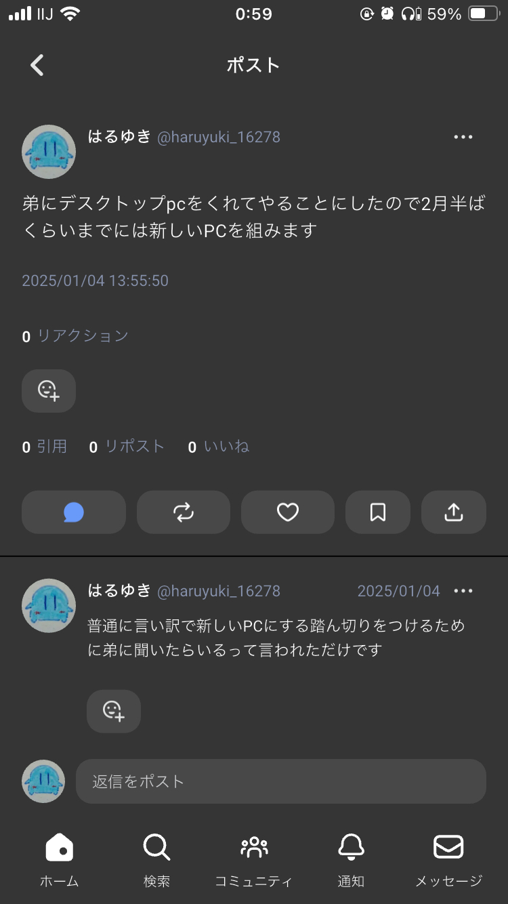
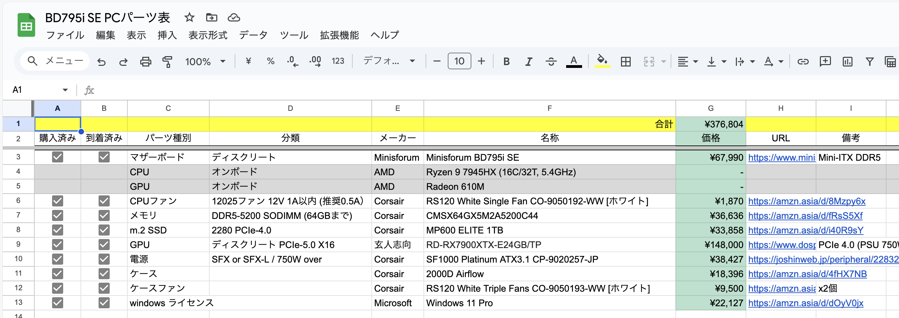
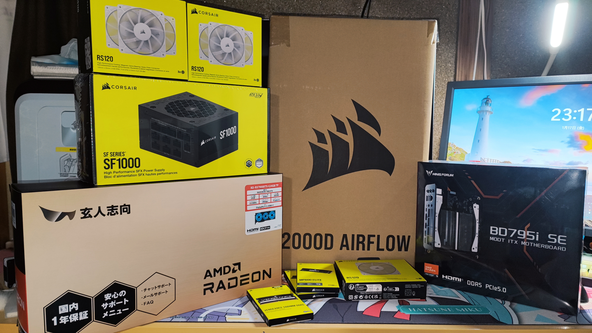
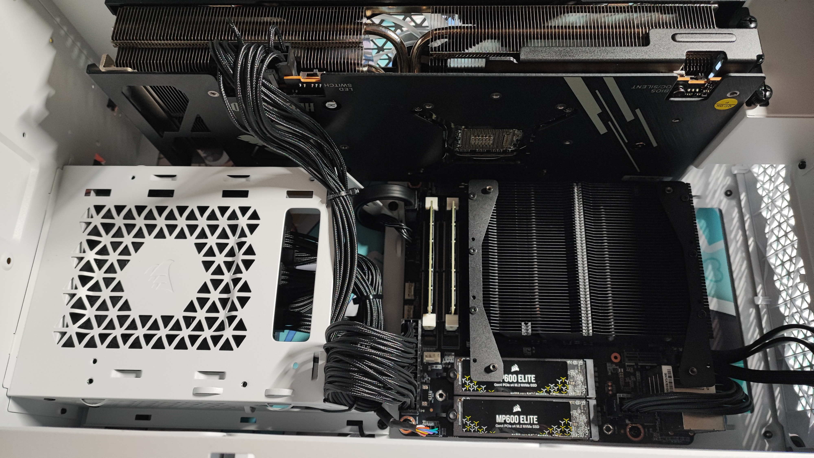
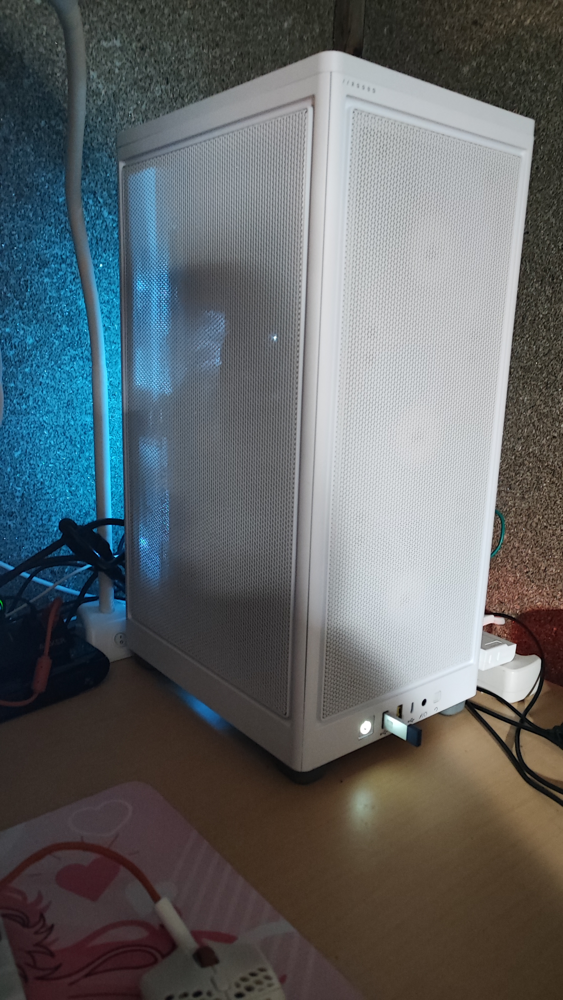
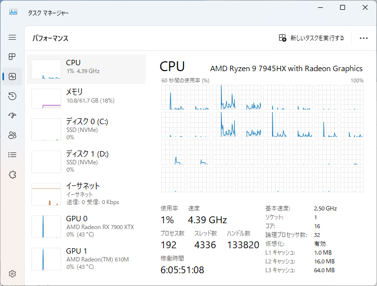

## (なるべく)CorsairのパーツでPC組んでみた(Ryzen 9 7945HX + Radeon RX7900XTX)

なんでこうなったかって...?  
なんかぼーっとネットサーフィンしてて、ふと「minisforumって年末年始セールとかやってんのかな」って思ったんです。  
そしたらもう何も考えずに買っちゃってましたよね.....

### 構成決め

さて、マザーボードを買ってしまった以上もうあとに引けません。  
腹くくってパーツを選ぶためにスプシも作っていざ！

↑のスクショはブログ書きながら撮ってるのでもう全部買って届いたことになってますが、最初はこんなCorsair狂みたいな感じで選ぶつもりじゃなかったんですよ。  
でかいグラボが収まるケースで探してケース選んで、ファンとメモリ選んだあたりで「あ、これいけるとこ全部Corsairにしよ」って思っちゃって。  
結果こうなったわけです。

### 組んだ

BD795i SE の説明書がちょっと丁寧じゃなかったり、ケースの2000Dの説明書もちょっとよくわかんなかったりで苦戦しつつ、組み上げました。

でっけぇ空冷クーラーとか水冷ラジエーターとかがないのでケースの中身は結構スカスカ。

起動すると7900XTXのファンが光って後ろから水色の発光が抜けてます。  
光るPCあんまり好きじゃないからファンとかも光らないのにしてるんだけど、この発光の感じはちょっとお気に入り。

### まとめ

え、ここで終わり！？ええそうです。  
ベンチマークとかあんまり回してないし、ゲームもやる暇なくてさわれてないからです。  
こういうのを宝の持ち腐れといいます。気をつけようね...

すげえ16C/32TのCPUのタスクマネージャー始めてみた。激アツ。
