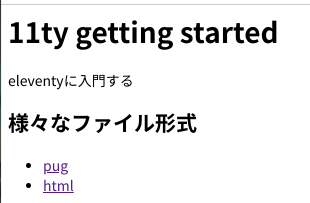
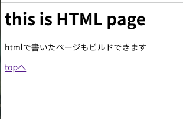
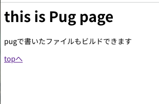

## [11ty](https://www.11ty.dev/)っていうSSGを試してみる

eleventy(日本語だとイレブンティかな？)というSSGを見つけてずっと気になっていたので試してみることにしました。  
なお字数が少ないので11tyと表記しようを思います。

### get started する

[11ty公式ドキュメント](https://www.11ty.dev/docs/get-started/)を見ながらget startedしてみます。

適当なリポジトリを用意して`npm init -y`したあと、`npm i @11ty/eleventy`して11tyを導入します。  
devserverが内蔵されてるっぽいので`npx @11ty/eleventy --serve`すると8080番で開発用サーバーが起動します。

githubでリポジトリを作る際に`README.md`を作成している場合は、`localhost:8080/README/`で`README.md`のビルド結果が見れます。

### configを書く

どうやらかなり柔軟にconfigを書けるようです。詳細は[11tyのconfigurationページ](https://www.11ty.dev/docs/config/)を確認してください。
`.eleventy.js`という名前でファイルを作成し、その中に設定を書いていきます。

ひとまず、ビルド元ディレクトリとビルド先ディレクトリを設定します。

```javascript
module.exports = function(eleventyConfig) {
  return {
    // ビルド元をsrcに
    // 出力先をdocsに
    dir: {
      input: 'src',
      output: 'docs'
    }
  };
};
```

これで開発用サーバーを確認すると、`README.md`がビルドに含まれていないのが確認できます。

### Markdown, HTML, Pugを試す

このあたりの自分が触ったことのあるマークアップでちょっと試してみました。

#### Markdown

```Markdown
# 11ty getting started

eleventyに入門する

## 様々なファイル形式

- [pug](/pug)
- [html](/html)
```



#### HTML

```HTML
<h1>this is HTML page</h1>

<p>htmlで書いたページもビルドできます</p>

<a href="/">topへ</a>
```



#### Pug

```pug
h1 this is Pug page

p pugで書いたファイルもビルドできます

a(href="/") topへ
```



### おわり

体感は「結構よさそう」って感じでした。これでGithub Pagesでblog書くのめちゃくちゃかんたんなんじゃ........  
なんとなくAngularでゴリゴリしたあとMarked.jsとかで変換かけてるこのブログ、数記事しか書いてないのに移行の機運です。

P.S. 公式ドキュメントの左ナビゲーションバー、白文字もクリックしてページ開けるのわからなくてだいぶ混乱しました。
