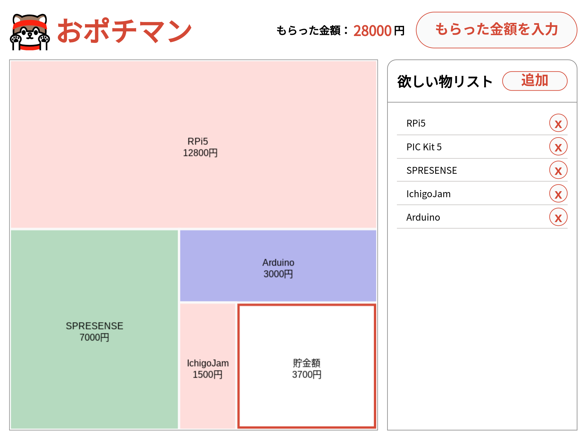

## あけましておめでとうございます！

今年もよろしくおねがいします。
では本題へ。

### お年玉の使いみち

もう今となっては社会人になり渡す側のお年玉。昔は使いみちにも迷ったものです。
そこで紹介したいのが[おポチマン](https://haruyuki-16278.github.io/opochiman/)です。

こちらは勤務先のオフィスで年末行った「年末ハックバトル」の成果物になります。ぜひ[福野さんのレポート](https://fukuno.jig.jp/4173)もご覧ください。

上から順に欲しい物を並べていくことで、もらった金額内で最も多くの欲を満たす買い方を示してくれます。

私はデザイン周りのかんたんな対応を担当したのですが、今回始めてアイコンをinkscapeで作ることに挑戦し、なかなかできない体験で新鮮でした。

### ツリーマップ

もともとはツリーマップ部分には[APEXCharts.js](https://apexcharts.com/)を利用する予定でした。が、仕様を考えている中で自前実装のほうが都合がいい部分が多そうだったため、今回は採用を見送りました。

当初はツリーマップのブロックを自分でD&Dで動かしてプランニングしていくようなアプリを想定したため、canvasのほうが都合がいいだろうとなりました。（実際はそこまで行き着きませんでしたが...）

### 展望

私事ですが、大変「貯金」というものが苦手です。
今回作ったおポチマンを改良して、月に使っていい金額などを逐次確認しながら使っていけるようなアプリを作れるといいなと思っています。暇になったら...

では新年もよろしくお願いします！
