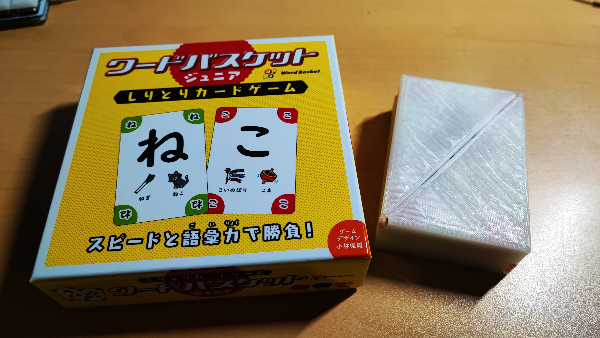
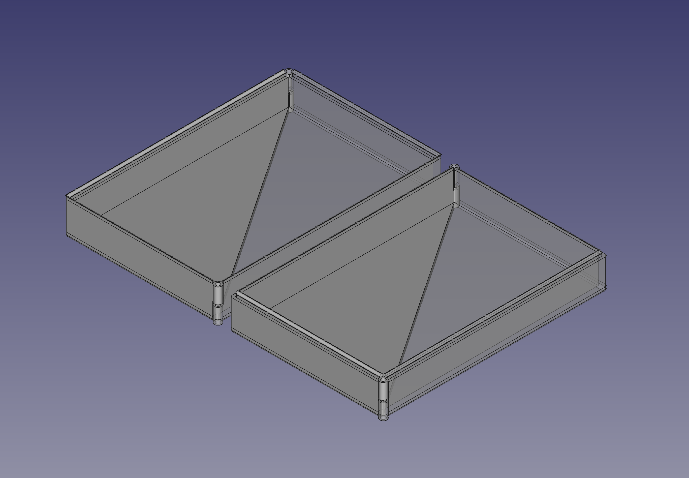
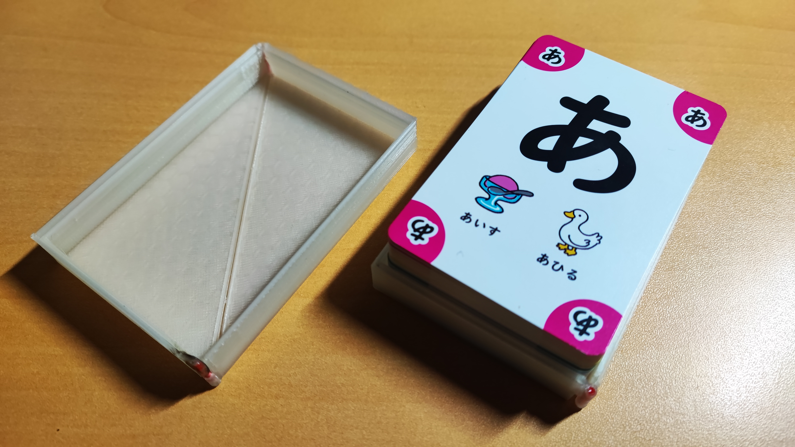
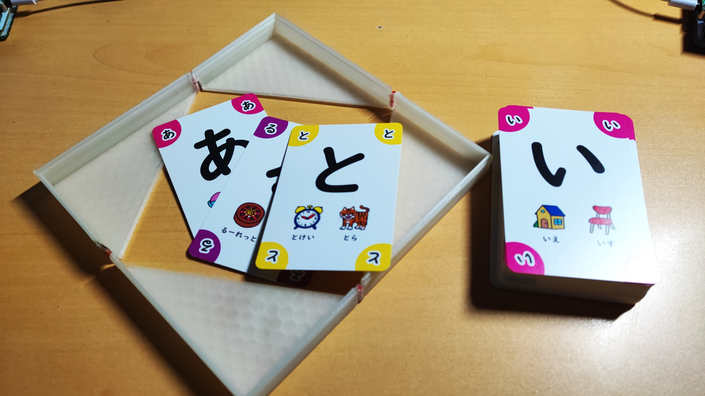

## 💼 [ワードバスケット](https://www.mobius-games.co.jp/mobiusgames/wordbasket.html)を布教した過ぎて持ち運びやすいケース作っちゃった

皆さんは「ワードバスケット」というゲームを知っていますか？  
場に出ているカードにかかれている文字で始まり、手札の文字で終わる単語をすばやく叫び、手札を最も早くなくしたプレイヤーが勝つ激オモロボードゲームです。

先日友人と食事に行った際、帰りがけに寄ったドン・キホーテでついうっかり[「ワードバスケット ジュニア」](https://www.gentosha-edu.co.jp/book/b441220.html)というバージョン違いのワードバスケットを買ってしまいました。  
もともと[メビウスゲームズ](https://www.mobius-games.co.jp/)さんの本家を持っているというのに...  
とはいえ、札にヒントが書いてあったり、本家にはないワイルドカードがあったりして初心者とも遊びやすい設計のようです。  
ちょうどあまりにも自分と友達の間に実力差があって遊んでもらえないがちになっていたので、これを買ってみんなにもう一度一緒に遊んでもらおうという算段です。

### 🚶 持ち運びたいけど...

ところでこのワードバスケット、持ち運んで友達と遊びたいのですが箱がカードを出す場になる関係上ある程度大きく、カバンにいれるとスペースが圧迫されてしまうんです。  

「3Dプリンターでカードにピッタリのケース作って、展開して場としても使えるようにすればよくね？」

というわけで現在メインで使っているCADソフト「FreeCAD」を起動し、ざっと設計します。

というわけでモデルが出来上がったので、スライスして3Dプリンターで印刷していきます。

### 🃏 カード入れてみた！

出来上がったケースを組み立てて、ワードバスケットのカードを収めてみました。

今回の思いつきポイントは、ヒンジの連結部分に1.75mmのフィラメントをそのままつかうことで印刷の手間を減らしたところです。  
多分世によくあるテクニックですが、設計して実際使ったのは初めてだったのでうまくいってニッコリ。

ちゃんと新調したノギスで確認して設計したのでカードの収まり方もぴったりです。  
この印刷したものが自分の考えたとおりに組み上がった瞬間って得も言われぬ快感がありますね。

で、ケースと開くと↓の感じになります。（ちょっと大きいけど）

思ってた通り、いい感じに使えそうです！  
普通のケースだと箱をひっくり返すだけでカードを回収できてたけど、それができないのがちょっと不便になりそうかなって感じ。

一応軽い設計ミスとか、組み立てのときに温めすぎて不必要に溶けてるとかもあったので作り直すことにはなりそうですが、ひとまずこれでワードバスケットモバイルケースを開発完了とします。  
じゃあ次は一緒に遊んでくれる友達も開発しようね〜...
