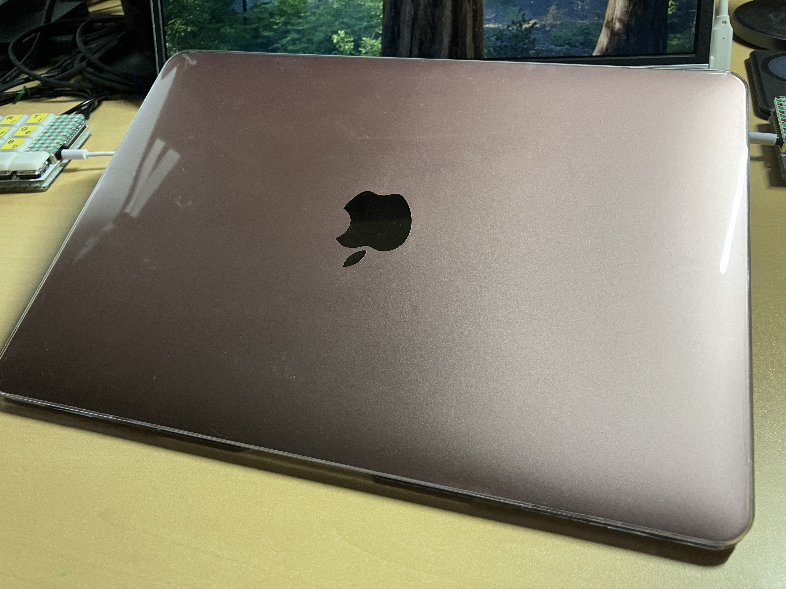

## ジャンクコーナーで見つけたmacbook(2017)をバッテリー交換に出した

先週の2/21に誕生日を迎えて24歳になりました、はるゆきです。

数ヶ月前になんとなくハードオフを訪れたところ、ジャンクコーナーにむき身でおいてあるmacbookが目に止まりました。  
ついている札には「22000」と書いてあり、持ってみるとハチャメチャに軽くて「持ち運ぶPCこれにしたらカバン軽くなるぞ」ということで購入。

しかし持ち帰って触っているとなんともまぁバッテリーが持たないこと持たないこと。せいぜい1.5hといったところでしょうか。  
流石にこれでは #スタバでMac とか言って意識高そうなエンジニアのフリをすることも叶わないので、どうにかしてバッテリー交換をしようと画策していました。

最初は自分で裏開けて交換するつもりだったのですが、[iFixit](https://jp.ifixit.com/Guide/Retina+MacBook+2017%E3%83%90%E3%83%83%E3%83%86%E3%83%AA%E3%83%BC+%E3%81%AE%E4%BA%A4%E6%8F%9B/110039)やブログ記事を読んでいるうちに「これ...金払ってやってもらうほうが楽じゃないか流石に」と気づくことに。  
というわけで自分で修理するのを諦めて依頼したサービスが [ポストリペア](https://postrepair.net/) でした。  
修理対象にしっかりmacbook 2017年モデルも記載があり、修理実績を見ても信頼できそうだったので問い合わせ。問い合わせのメール対応も大変良くしていただき、発送から5日程度でバッテリー交換を終えたmacbookが手元に帰ってきました。最高。

3年くらいchromebook(C436FA)で個人開発をやってきたのですが、今後はmacbookを持ち運ぶ生活に変わっていきそうです。  
それはそうとしてMacOSのバージョン上限があるのでいい感じのLinuxディストリビューションを探していきたいですね。